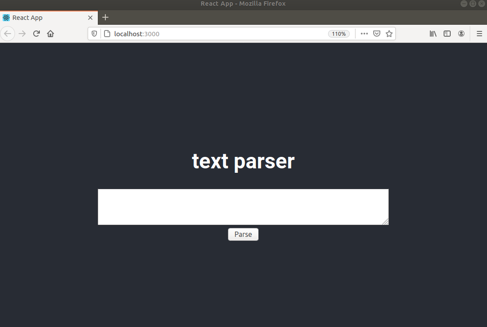
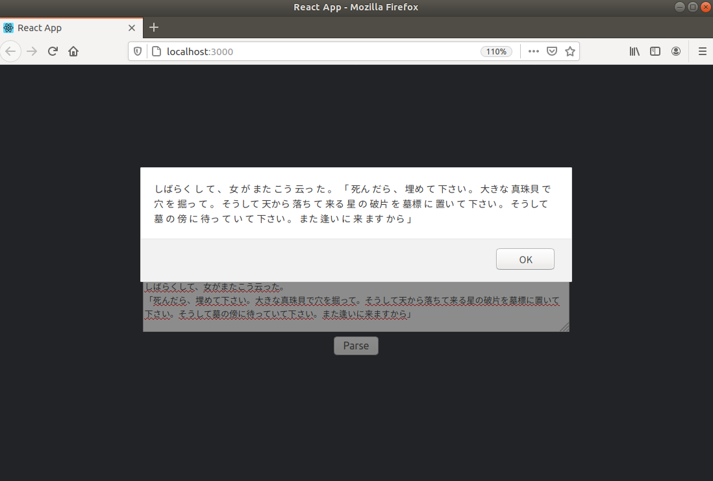

# jparser_app
**日本語分かち書きアプリ**

mecabを利用した分かち書きができるwebアプリ

## SETTING
開発環境
```
OS: Ubuntu
Python: 3.6
npm: 6.14.7
```

### backend
`/backend/`下で以下のコマンドを実行してください。

`pip install -r requirements.txt`

### frontend
以下のコマンドを実行してください。

`npm install axios`


## USAGE
フロントエンド/バックエンド用にそれぞれターミナルを立ち上げて以下のコマンドを実行してください。


### backend
```
$ cd backend
$ python server.py
```

### frontend
```
$ cd frontend/app
$ yarn start
```

ブラウザから`localhost:3000`にアクセスします(`yarn start`で自動で開きます)。


### app screenshots




